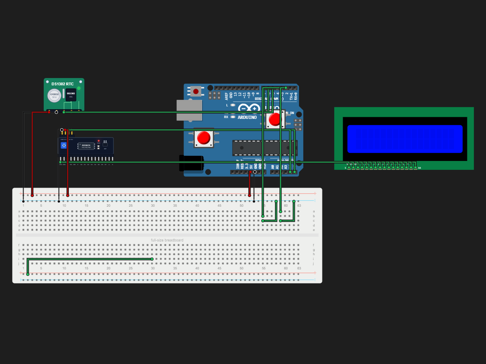

# Clock

> Built in [Breadboard](https://breadboard.hackclub.com), a Hack Club program. This project took ~1.3 hours of work.

## What It Does

its a basic clock with stop wtch feature added to it

## How It Works

The circuit is captured in `breadboard-project.json`, and the firmware that runs it is in the `firmware/` folder.

## How To Use It

pls use it as like a regular clock dont worry newer version would come . currently one button is for mode changing between stopwatch and the regular clock
the other is the start and stop of the stopwatch

## Demo

- **Simulate it live:** [https://breadboard.hackclub.com/share/223](https://breadboard.hackclub.com/share/223), runs the firmware in the Breadboard simulator
- **View the design:** [https://taniwankenobi.github.io/breadboard-plays/p/223/](https://taniwankenobi.github.io/breadboard-plays/p/223/)

## Schematic

The editor snapshot is in `breadboard-project.json`.

## Bill of Materials

| Part | Quantity |
| --- | --- |
| breadboard-full | 1 |
| ds1302 | 1 |
| lcd1602 | 1 |
| lcd1602-i2c | 1 |
| pushbutton | 2 |

## Firmware

Firmware files are in the `firmware/` folder.

## Build Journal

Build journal entries are kept in [`journals.md`](journals.md).

---

*Made in [Breadboard](https://breadboard.hackclub.com) — 1.3h of work*

